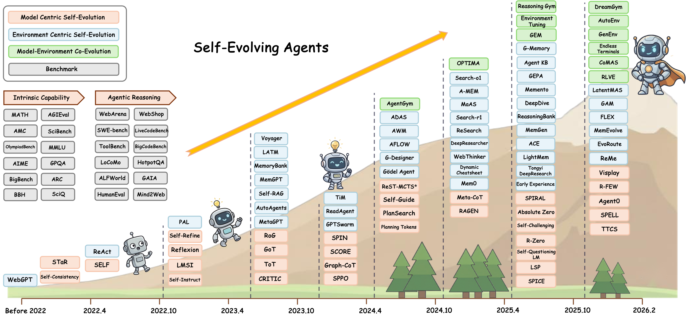
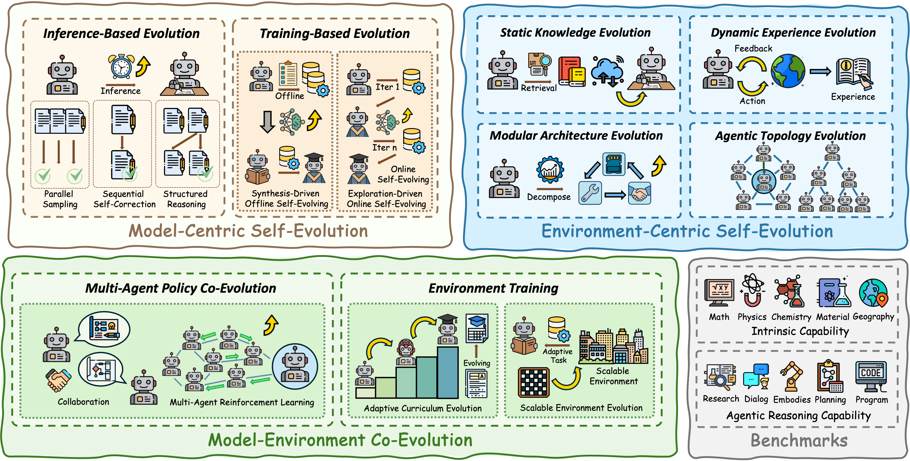
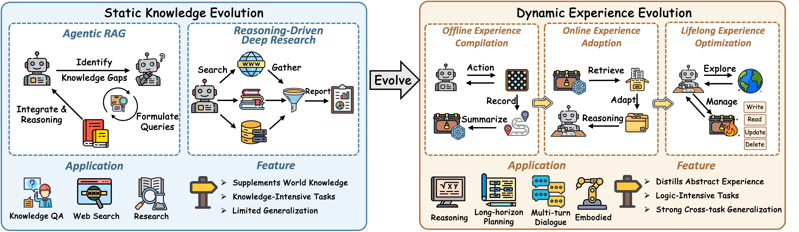
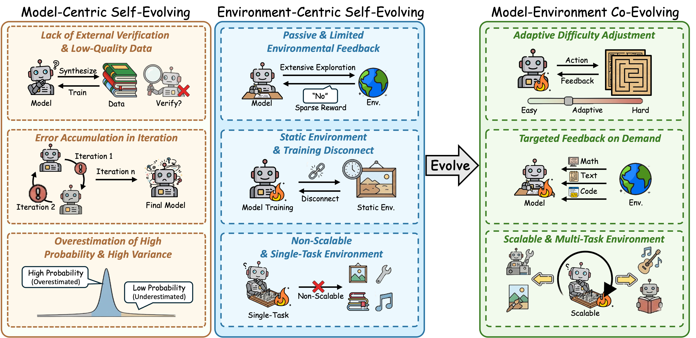

# Awesome-Self-Evolving-Agents

<div align="center">
    <a href="https://awesome.re"></a>
    <a href="http://makeapullrequest.com"></a>
     <a href="https://www.researchgate.net/publication/401016261_A_Systematic_Survey_of_Self-Evolving_Agents_From_Model-Centric_to_Environment-Driven_Co-Evolution" target="_blank"></a>
     <a href="http://makeapullrequest.com"></a>
</div>

# 🎉 News
- **[2026-02]** We release the [TTCS](https://github.com/XMUDeepLIT/TTCS), a self-evolving framework.
- **[2026-02]** We release the [Agentic Self-Evolving survey](https://github.com/XMUDeepLIT/Awesome-Agentic-Self-Evolution).

---


<h2 id="about">📖 About</h2> 

This repository provides a comprehensive collection of research papers, benchmarks, and open-source projects on **Self-Evolving Agents**. It includes contents from our survey paper 📖<em>"[**A Systematic Survey of Self-Evolving Agents: From Model-Centric to Environment-Driven Co-Evolution**](https://www.researchgate.net/publication/401016261_A_Systematic_Survey_of_Self-Evolving_Agents_From_Model-Centric_to_Environment-Driven_Co-Evolution)"</em> and will be continuously updated.

🤗 **You are very welcome to contribute to this repository** by launching an issue or a pull request. If you find any missing resources or come across interesting new research works, please don’t hesitate to open an issue or submit a PR!

📫 **Contact us via emails:** `{xiangzhishang,yangchengyi}@stu.xmu.edu.cn`, `qinggang.zhang@polyu.edu.hk`

<div>
<h3 align="center">
   <p align="center"></p>
    <p align="center"><em>The development trends in the field of Agentic Self-Evolving with representative works.</em></p>
</div>

Agentic Self-Evolving represents a paradigm shift in AI development, enabling systems to autonomously improve through three key dimensions:

- **Model-Centric Self-Evolution**: Focuses on improving the model itself through inference-based evolution (parallel sampling, sequential self-correction, structured reasoning) and training-based evolution (synthesis-driven offline and exploration-driven online self-evolving).

- **Environment-Centric Self-Evolution**: Enhances the agent's interaction with external knowledge and experience through static knowledge evolution, dynamic experience evolution, modular architecture evolution, and agentic topology evolution.

- **Model-Environment Co-Evolution**: Enables simultaneous evolution of both the model and its environment through environment training and multi-agent policy co-evolution.

---

# Agentic Self-Evolving
Agentic Self-Evolving represents a paradigm of autonomous continuous improvement, where an agent progressively enhances its capabilities through self-driven learning. It is characterized by two essential properties: **(i) Strong autonomy with minimal human supervision**, enabling the agent to generate learning signals without relying on external annotations. **(ii) Actively exploration through interaction**, where the agent actively interacts with itself and the external environment to discover feedback and learning opportunities.

<h3 align="center">
   <p align="center"></p>
    <p align="center"><em>The three dimensions of Agentic Self-Evolving.</em></p>


## Table of Content
- [🍀 Citation](#-citation)
- [📫 Contact Us](#-contact-us)
- [📈 Trend of Agentic Self-Evolving Research](#-trend-of-agentic-self-evolution-research)
- [📜 Research Papers](#-research-papers)
    - [Model-Centric Self-Evolution](#model-centric-self-evolving)
        - [Inference-Based Evolution](#inference-based-evolution)
            - [Parallel Sampling](#parallel-sampling)
            - [Sequential Self-Correction](#sequential-self-correction)
            - [Structured Reasoning](#structured-reasoning)
        - [Training-Based Evolution 🔥](#training-based-evolution)
            - [Synthesis-Driven Offline Self-Evolving](#synthesis-driven-offline-self-evolving)
            - [Exploration-Driven Online Self-Evolving 🔥](#exploration-driven-online-self-evolving)
    - [Environment-Centric Self-Evolution](#environment-centric-self-evolving)
        - [Static Knowledge Evolution](#static-knowledge-evolution)
            - [Agentic Retrieval-Augmented Generation](#agentic-retrieval-augmented-generation)
            - [Reasoning-Driven Deep Research](#reasoning-driven-deep-research)
        - [Dynamic Experience Evolution 🔥](#dynamic-experience-evolution)
            - [Offline Experience Compilation](#offline-experience-compilation)
            - [Online Experience Adaptation](#online-experience-adaptation)
            - [Lifelong Experience Evolution 🔥](#lifelong-experience-evolution)
        - [Modular Architecture Evolution](#modular-architecture-evolution)
            - [Interaction Protocol Evolution](#interaction-protocol-evolution)
            - [Memory Topology Evolution](#memory-topology-evolution)
            - [Tool-Augmented Evolution](#tool-augmented-evolution)
        - [Agentic Topology Evolution](#agentic-topology-evolution)
            - [Offline Architecture Search](#offline-architecture-search)
            - [Runtime Dynamic Adaptation](#runtime-dynamic-adaptation)
            - [Structural Memory Evolution](#structural-memory-evolution)
    - [Model-Environment Co-Evolution 🔥](#model-environment-co-evolving)
        - [Multi-Agent Policy Co-Evolution](#multi-agent-policy-co-evolution)
        - [Environment Training 🔥](#environment-training)
            - [Adaptive Curriculum Evolution](#adaptive-curriculum-evolution)
            - [Scalable Environment Evolution](#scalable-environment-evolution)

- [📚 Related Survey Papers](#-related-survey-papers)
- [🏆 Benchmarks](#-benchmarks)
- [💻 Open Source Libraries](#-open-source-libraries)
- [🚀 Applications](#-applications)
    - [Automated Scientific Discovery](#automated-scientific-discovery)
    - [Autonomous Software Engineering](#autonomous-software-engineering)
    - [Open-World Simulation](#open-world-simulation)
- [⭐ Star History](#-star-history)


# 📜 Research Papers


## Model-Centric Self-Evolution


### Inference-Based Evolution


#### Parallel Sampling

- (ICLR'23) Self-consistency improves chain of thought reasoning in language models [[Paper]](https://arxiv.org/abs/2203.11171)
- (NeurIPS'24) Are more llm calls all you need? towards scaling laws of compound inference systems [[Paper]](https://proceedings.neurips.cc/paper_files/paper/2024/hash/51173cf34c5faac9796a47dc2fdd3a71-Abstract-Conference.html)
- (arxiv'24) Large language monkeys: Scaling inference compute with repeated sampling [[Paper]](https://arxiv.org/abs/2407.21787)
- (arxiv'24) Scaling llm test-time compute optimally can be more effective than scaling model parameters [[Paper]](https://arxiv.org/abs/2408.03314)
- (ACL'23) Llm-blender: Ensembling large language models with pairwise ranking and generative fusion [[Paper]](https://aclanthology.org/2023.acl-long.792/)
- (EMNLP'23) Selfcheckgpt: Zero-resource black-box hallucination detection for generative large language models [[Paper]](https://aclanthology.org/2023.emnlp-main.557/)


#### Sequential Self-Correction

- (NeurIPS'23) Self-refine: Iterative refinement with self-feedback [[Paper]](https://proceedings.neurips.cc/paper_files/paper/2023/hash/91edff07232fb1b55a505a9e9f6c0ff3-Abstract-Conference.html)
- (ICLR'24) Teaching large language models to self-debug [[Paper]](https://arxiv.org/abs/2304.05128)
- (ACL'24 findings) Small language models need strong verifiers to self-correct reasoning [[Paper]](https://aclanthology.org/2024.findings-acl.924/)
- (NeurIPS'23) Reflexion: Language agents with verbal reinforcement learning [[Paper]](https://proceedings.neurips.cc/paper_files/paper/2023/hash/1b44b878bb782e6954cd888628510e90-Abstract-Conference.html)
- (ICLR'24) Critic: Large language models can self-correct with tool-interactive critiquing [[Paper]](https://arxiv.org/abs/2305.11738)
- (arxiv'25) Evolving deeper llm thinking [[Paper]](https://arxiv.org/abs/2501.09891)
- (arxiv'25) Towards system 2 reasoning in llms: Learning how to think with meta chain-of-thought [[Paper]](https://arxiv.org/abs/2501.04682)
- (ICLR'25) Planning in natural language improves llm search for code generation [[Paper]](https://arxiv.org/abs/2409.03733)
- (ICML'25) Reasoning-as-logic-units: Scaling test-time reasoning in large language models through logic unit alignment [[Paper]](https://arxiv.org/abs/2502.07803)


#### Structured Reasoning

- (arxiv'24) Stream of search (sos): Learning to search in language [[Paper]](https://arxiv.org/abs/2404.03683)
- (NeurIPS'24) Toward self-improvement of llms via imagination, searching, and criticizing [[Paper]](https://proceedings.neurips.cc/paper_files/paper/2024/hash/5e5853f35164e434015716a8c2a66543-Abstract-Conference.html)
- (ICML'24) Alphazero-like tree-search can guide large language model decoding and training [[Paper]](https://arxiv.org/abs/2309.17179)
- (arxiv'24) Litesearch: Efficacious tree search for llm [[Paper]](https://arxiv.org/abs/2407.00320)
- (NeurIPS 2023) Tree of thoughts: Deliberate problem solving with large language models, [[Paper]](https://proceedings.neurips.cc/paper/2023/hash/271db9922b8d1f4dd7aaef84ed5ac703-Abstract.html)
- (ICML'24) Language agent tree search unifies reasoning acting and planning in language models [[Paper]](https://arxiv.org/abs/2310.04406)
- (ICLR'24) Think-on-graph: Deep and responsible reasoning of large language model on knowledge graph [[Paper]](https://arxiv.org/abs/2307.07697)
- (ICLR'25) Think-on-graph 2.0: Deep and faithful large language model reasoning with knowledge-guided retrieval augmented generation [[Paper]](https://arxiv.org/abs/2407.10805)
- (ICLR'24) Reasoning on graphs: Faithful and interpretable large language model reasoning [[Paper]](https://arxiv.org/abs/2310.01061)


### Training-Based Evolution 🔥

<h3 align="center">
   <p align="center"></p>


#### Synthesis-Driven Offline Self-Evolving

- (TMLR'24) Beyond human data: Scaling self-training for problem-solving with language models [[Paper]](https://arxiv.org/abs/2312.06585)
- (NeurIPS'25 workshop) Learning to solve and verify: A self-play framework for code and test generation [[Paper]](https://arxiv.org/abs/2502.14948)
- (arxiv'25) Evolving language models without labels: Majority drives selection, novelty promotes variation [[Paper]](https://arxiv.org/abs/2509.15194)
- (arxiv'25) Test-time offline reinforcement learning on goal-related experience [[Paper]](https://arxiv.org/abs/2507.18809)
- (arxiv'25) Agent-R: Training Language Model Agents to Reflect via Iterative Self-Training [[Paper]](https://arxiv.org/abs/2501.11425)
- (ACL'23) Self-instruct: Aligning language models with self-generated instructions [[Paper]](https://aclanthology.org/2023.acl-long.754.pdf)
- (COLM'24) Self-guide: Better task-specific instruction following via self-synthetic finetuning [[Paper]](https://arxiv.org/abs/2407.12874)
- (NeurIPS'25) Self-Adapting Language Models [[Paper]](https://arxiv.org/abs/2506.10943)
- (arxiv'23) Self: Self-evolution with language feedback [[Paper]](https://arxiv.org/abs/2310.00533)
- (ICML'24) Self-play fine-tuning converts weak language models to strong language models [[Paper]](https://arxiv.org/abs/2401.01335)
- (ICLR'25) Self-play preference optimization for language model alignment [[Paper]](https://arxiv.org/abs/2405.00675)
- (NeurIPS'22) Star: Bootstrapping reasoning with reasoning [[Paper]](https://proceedings.neurips.cc/paper_files/paper/2022/hash/639a9a172c044fbb64175b5fad42e9a5-Abstract-Conference.html)
- (EMNLP'23) Large language models can self-improve [[Paper]](https://aclanthology.org/2023.emnlp-main.67/)
- (NeurIPS'24) Rest-mcts*: Llm self-training via process reward guided tree search [[Paper]](https://proceedings.neurips.cc/paper_files/paper/2024/hash/76ec4dc30e9faaf0e4b6093eaa377218-Abstract-Conference.html)
- (ICML'25) Self-improving language models for evolutionary program synthesis: A case study on ARC-AGI [[Paper]](https://icml.cc/virtual/2025/poster/43499)
- (NeurIPS'25) Sirius: Self-improving multi-agent systems via bootstrapped reasoning [[Paper]](https://neurips.cc/virtual/2025/loc/san-diego/poster/118834)
- (arxiv'25) Ragen: Understanding self-evolution in llm agents via multi-turn reinforcement learning [[Paper]](https://arxiv.org/abs/2504.20073)
- (EMNLP'25) Samule: Self-learning agents enhanced by multi-level reflection [[Paper]](https://aclanthology.org/2025.emnlp-main.839/)


#### Exploration-Driven Online Self-Evolving 🔥

- (arxiv'26) TTCS: Test-Time Curriculum Synthesis for Self-Evolving [[Paper]](https://arxiv.org/abs/2601.22628)
- (NeurIPS'25) Co-evolving llm coder and unit tester via reinforcement learning [[Paper]](neurips.cc/virtual/2025/loc/san-diego/poster/115329)
- (arxiv'25) Towards agentic self-learning llms in search environment [[Paper]](https://arxiv.org/abs/2510.14253)
- (arxiv'25) Multi-agent evolve: Llm self-improve through co-evolution [[Paper]](https://arxiv.org/abs/2510.23595)
- (ICLR'26) Steporlm: A self-evolving framework with generative process supervision for operations research language models [[Paper]](https://arxiv.org/abs/2509.22558)
- (NeurIPS'24) Coevolving with the other you: Fine-tuning llm with sequential cooperative multi-agent reinforcement learning [[Paper]](https://neurips.cc/virtual/2024/poster/95347)
- (ICLR'26) R-zero: Self-evolving reasoning llm from zero data [[Paper]](https://arxiv.org/abs/2508.05004)
- (NeurIPS'25) Absolute zero: Reinforced self-play reasoning with zero data [[Paper]](https://neurips.cc/virtual/2025/loc/san-diego/poster/116121)
- (arxiv'25) Language self-play for data-free training [[Paper]](https://arxiv.org/abs/2509.07414)
- (arxiv'25) Self-questioning language models [[Paper]](https://arxiv.org/abs/2508.03682)
- (arxiv'25) SPIRAL: Self-Play on Zero-Sum Games Incentivizes Reasoning via Multi-Agent Multi-Turn Reinforcement Learning [[Paper]](https://arxiv.org/abs/2506.24119)
- (arxiv'25) Socratic-zero: Bootstrapping reasoning via data-free agent co-evolution [[Paper]](https://arxiv.org/abs/2509.24726)
- (arxiv'25) Agent0: Unleashing self-evolving agents from zero data via tool-integrated reasoning [[Paper]](https://arxiv.org/abs/2511.16043)
- (NeurIPS'25) SeRL: Self-Play Reinforcement Learning for Large Language Models with Limited Data [[Paper]](https://neurips.cc/virtual/2025/loc/san-diego/poster/117365)
- (arxiv'26) Dr. Zero: Self-Evolving Search Agents without Training Data [[Paper]](https://arxiv.org/abs/2601.07055)
- (ICLR'26) Theoretical Modeling of LLM Self-Improvement Training Dynamics Through Solver-Verifier Gap [[Paper]](https://arxiv.org/abs/2507.00075)
- (ICLR'26) Search self-play: Pushing the frontier of agent capability without supervision [[Paper]](https://arxiv.org/abs/2510.18821)
- (arxiv'25) ReVeal: Self-Evolving Code Agents via Iterative Generation-Verification [[Paper]](https://arxiv.org/abs/2506.11442)
- (NeurIPS'25) Self-challenging language model agents [[Paper]](https://neurips.cc/virtual/2025/loc/san-diego/poster/119495)
- (ICLR'26) Spice: Self-play in corpus environments improves reasoning [[Paper]](https://arxiv.org/abs/2510.24684)
- (ICLR'26) Spell: Self-play reinforcement learning for evolving long-context language models [[Paper]](https://arxiv.org/abs/2509.23863)
- (ICLR'25) Webrl: Training llm web agents via self-evolving online curriculum reinforcement learning [[Paper]](https://arxiv.org/abs/2411.02337)
- (arxiv'25) Ladder: Self-improving llms through recursive problem decomposition [[Paper]](https://arxiv.org/abs/2503.00735)
- (arxiv'25) Guided self-evolving llms with minimal human supervision [[Paper]](https://arxiv.org/abs/2512.02472)
- (AAAI'25) Empowering Self-Learning of LLMs: Inner Knowledge Explicitation as a Catalyst [[Paper]](https://ojs.aaai.org/index.php/AAAI/article/view/34590)
- (NeurIPS'25) Spc: Evolving self-play critic via adversarial games for llm reasoning [[Paper]](https://neurips.cc/virtual/2025/loc/san-diego/poster/118706)
- (ICLR'26) Your agent may misevolve: Emergent risks in self-evolving llm agents [[Paper]](https://arxiv.org/abs/2509.26354)


## Environment-Centric Self-Evolution

<h3 align="center">
   <p align="center"></p>


### Static Knowledge Evolution


#### Agentic Retrieval-Augmented Generation

- (ICLR'24) Self-rag: Learning to retrieve, generate, and critique through self-reflection [[Paper]](https://arxiv.org/abs/2310.11511)
- (ACL'25) Rag-critic: Leveraging automated critic-guided agentic workflow for retrieval augmented generation [[Paper]](https://aclanthology.org/2025.acl-long.179/)
- (EMNLP'25) Search-o1: Agentic search-enhanced large reasoning models [[Paper]](https://aclanthology.org/2025.emnlp-main.276.pdf)
- (COLM 2025) Search-r1: Training llms to reason and leverage search engines with reinforcement learning [[Paper]](https://arxiv.org/abs/2503.09516)
- (arxiv'25) Learning to reason with search for llms via reinforcement learning [[Paper]](https://arxiv.org/abs/2503.19470)
- (arxiv'25) R1-searcher: Incentivizing the search capability in llms via reinforcement learning [[Paper]](https://arxiv.org/abs/2503.05592)
- (ACL'23) Webcpm: Interactive web search for chinese long-form question answering [[Paper]](https://aclanthology.org/2023.acl-long.499/)
- (NeurIPS'23 workshop)Dspy: Compiling declarative language model calls into self-improving pipelines [[Paper]](https://arxiv.org/abs/2310.03714)
- (ICLR'25) Mindsearch: Mimicking human minds elicits deep ai searcher [[Paper]](https://arxiv.org/abs/2407.20183)
- (arxiv'25) Open deep search: Democratizing search with open-source reasoning agents [[Paper]](https://arxiv.org/abs/2503.20201)


#### Reasoning-Driven Deep Research

- (arxiv'25) DeepResearch Bench: A Comprehensive Benchmark for Deep Research Agents [[Paper]](https://arxiv.org/abs/2506.11763)
- (arxiv'25) Deep research agents: A systematic examination and roadmap [[Paper]](https://arxiv.org/abs/2506.18096)
- (ACL'24) Webvoyager: Building an end-to-end web agent with large multimodal models [[Paper]](https://aclanthology.org/anthology-files/pdf/acl/2024.acl-long.371.pdf)
- (arxiv'25) Deepdive: Advancing deep search agents with knowledge graphs and multi-turn rl [[Paper]](https://arxiv.org/abs/2509.10446)
- (arxiv'25) DeepSearch: Overcome the Bottleneck of Reinforcement Learning with Verifiable Rewards via Monte Carlo Tree Search [[Paper]](https://arxiv.org/abs/2509.25454)
- (arxiv'25) Hiersearch: A hierarchical enterprise deep search framework integrating local and web searches [[Paper]](https://arxiv.org/abs/2508.08088)
- (EMNLP'25) Deepresearcher: Scaling deep research via reinforcement learning in real-world environments [[Paper]](https://aclanthology.org/2025.emnlp-main.22/)
- (arxiv'25) Sfr-deepresearch: Towards effective reinforcement learning for autonomously reasoning single agents [[Paper]](https://arxiv.org/abs/2509.06283)
- (arxiv'25) Tongyi deepresearch technical report [[Paper]](https://arxiv.org/abs/2510.24701)
- (arxiv'25) Webweaver: Structuring web-scale evidence with dynamic outlines for open-ended deep research [[Paper]](https://arxiv.org/abs/2509.13312)
- (arxiv'25) Webthinker: Empowering large reasoning models with deep research capability [[Paper]](https://arxiv.org/abs/2504.21776)
- (arxiv'25) Surveyx: Academic survey automation via large language models [[Paper]](https://arxiv.org/abs/2502.14776)

### Dynamic Experience Evolution 🔥


#### Offline Experience Compilation

- (arxiv'25) Remember me, refine me: A dynamic procedural memory framework for experience-driven agent evolution [[Paper]](https://arxiv.org/abs/2512.10696)
- (arxiv'25) Get Experience from Practice: LLM Agents with Record & Replay [[Paper]](https://arxiv.org/abs/2505.17716)
- (arxiv'25) Skillweaver: Web agents can self-improve by discovering and honing skills [[Paper]](https://arxiv.org/abs/2504.07079)
- (ICML'25) Agent kb: Leveraging cross-domain experience for agentic problem solving [[Paper]](https://arxiv.org/abs/2507.06229)
- (arxiv'25) From experience to strategy: Empowering llm agents with trainable graph memory [[Paper]](https://arxiv.org/abs/2511.07800)
- (arxiv'24) Cops: Empowering llm agents with provable cross-task experience sharing [[Paper]](https://arxiv.org/abs/2410.16670)
- (arxiv'25) Arcmemo: Abstract reasoning composition with lifelong llm memory [[Paper]](https://arxiv.org/abs/2509.04439)


#### Online Experience Adaptation

- (arxiv'26) ExpSeek: Self-Triggered Experience Seeking for Web Agents [[Paper]](https://arxiv.org/abs/2601.08605)
- (arxiv'25) Dynamic cheatsheet: Test-time learning with adaptive memory [[Paper]](https://arxiv.org/abs/2504.07952)
- (arxiv'25) Memento: Fine-tuning llm agents without fine-tuning llms [[Paper]](https://arxiv.org/abs/2508.16153)
- (ICLR'26) Gepa: Reflective prompt evolution can outperform reinforcement learning [[Paper]](https://arxiv.org/abs/2507.19457)
- (ICLR'26) Agentic context engineering: Evolving contexts for self-improving language models [[Paper]](https://arxiv.org/abs/2510.04618)


#### Lifelong Experience Evolution 🔥

- (arxiv'25) Xolver: Multi-Agent Reasoning with Holistic Experience Learning Just Like an Olympiad Team [[Paper]](https://arxiv.org/abs/2506.14234)
- (arxiv'25) Agentevolver: Towards efficient self-evolving agent system [[Paper]](https://arxiv.org/abs/2511.10395)
- (arxiv'26) Evolving Programmatic Skill Networks [[Paper]](https://arxiv.org/abs/2601.03509)
- (arxiv'26) Meta Context Engineering via Agentic Skill Evolution [[Paper]](https://arxiv.org/abs/2601.21557)
- (arxiv'26) Self-Consolidation for Self-Evolving Agents [[Paper]](https://arxiv.org/abs/2602.01966)
- (ICLR'26) Reasoningbank: Scaling agent self-evolving with reasoning memory [[Paper]](https://arxiv.org/abs/2509.25140)
- (arxiv'25) Evolver: Self-evolving llm agents through an experience-driven lifecycle [[Paper]](https://arxiv.org/abs/2510.16079)
- (arxiv'25) Training-free group relative policy optimization [[Paper]](https://arxiv.org/abs/2510.08191)
- (arxiv'25) Flex: Continuous agent evolution via forward learning from experience [[Paper]](https://arxiv.org/abs/2511.06449)
- (arxiv'25) Agent learning via early experience [[Paper]](https://arxiv.org/abs/2510.08558)
- (COLM'25)Inducing programmatic skills for agentic tasks [[Paper]](https://arxiv.org/abs/2504.06821)
- (arxiv'25) Reinforcement learning for self-improving agent with skill library [[Paper]](https://arxiv.org/abs/2512.17102)
- (arxiv'25) AccelOpt: A Self-Improving LLM Agentic System for AI Accelerator Kernel Optimization [[Paper]](https://arxiv.org/abs/2511.15915)
- (ICLR'26) Memgen: Weaving generative latent memory for self-evolving agents [[Paper]](https://arxiv.org/abs/2509.24704)
- (arxiv'25) Latentevolve: Self-evolving test-time scaling in latent space [[Paper]](https://arxiv.org/abs/2509.24771)


### Modular Architecture Evolution


#### Interaction Protocol Evolution

- (arxiv'23) Think-in-memory: Recalling and post-thinking enable llms with long-term memory [[Paper]](https://arxiv.org/abs/2311.08719)
- (EMNLP'23) Mot: Memory-of-thought enables chatgpt to self-improve [[Paper]](https://aclanthology.org/2023.emnlp-main.392/)
- (ICML'24) A human-inspired reading agent with gist memory of very long contexts [[Paper]](https://arxiv.org/abs/2402.09727)
- (ICLR'26) Lightmem: Lightweight and efficient memory-augmented generation [[Paper]](https://arxiv.org/abs/2510.18866)
- (arxiv'25) General agentic memory via deep research [[Paper]](https://arxiv.org/abs/2511.18423)
- (arxiv'23) MemGPT: Towards LLMs as Operating Systems[[Paper]](https://arxiv.org/abs/2310.08560)
- (AAAI'24) Memorybank: Enhancing large language models with long-term memory [[Paper]](https://ojs.aaai.org/index.php/AAAI/article/view/29946)
- (ICLR'26) AgentFold: Long-Horizon Web Agents with Proactive Context Management [[Paper]](https://arxiv.org/abs/2510.24699)


#### Memory Architecture Evolution

- (ICML'25) M+: Extending MemoryLLM with Scalable Long-Term Memory
- (arxiv'26) MemSkill: Learning and Evolving Memory Skills for Self-Evolving Agents [[Paper]](https://arxiv.org/abs/2602.02474)
- (arxiv'26) MemRL: Self-Evolving Agents via Runtime Reinforcement Learning on Episodic Memory [[Paper]](https://arxiv.org/abs/2601.03192)
- (NeurIPS'25) A-mem: Agentic memory for llm agents [[Paper]](https://arxiv.org/abs/2502.12110)
- (arxiv'25) Mem0: Building production-ready ai agents with scalable long-term memory [[Paper]](https://arxiv.org/abs/2504.19413)
- (NeurIPS'25) Cam: A constructivist view of agentic memory for llm-based reading comprehension [[Paper]](https://arxiv.org/abs/2510.05520)
- (arxiv'25) Memory as action: Autonomous context curation for long-horizon agentic tasks [[Paper]](https://arxiv.org/abs/2510.12635)
- (arxiv'25) Mem-α: Learning Memory Construction via Reinforcement Learning [[Paper]](https://arxiv.org/abs/2509.25911)
- (arxiv'25) Memevolve: Meta-evolution of agent memory systems [[Paper]](https://arxiv.org/abs/2512.18746)
- (arxiv'26) EvoRoute: Experience-Driven Self-Routing LLM Agent Systems [[Paper]](https://arxiv.org/abs/2601.02695)


#### Tool-Augmented Evolution

- (ICLR'26) Toward Effective Tool-Integrated Reasoning via Self-Evolved Preference Learning [[Paper]](https://arxiv.org/abs/2509.23285)
- (ICLR'23) React: Synergizing reasoning and acting in language models [[Paper]](https://arxiv.org/abs/2210.03629)
- (arxiv'21) Webgpt: Browser-assisted question-answering with human feedback [[Paper]](https://arxiv.org/abs/2112.09332)
- (ICML'23) Pal: Program-aided language models [[Paper]](https://arxiv.org/abs/2211.10435)
- (TMLR'24) Voyager: An open-ended embodied agent with large language models [[Paper]](https://arxiv.org/abs/2305.16291)
- (ICLR'24) Large language models as tool makers [[Paper]](https://arxiv.org/abs/2305.17126)
- (EMNLP'23 findings)Creator: Tool creation for disentangling abstract and concrete reasoning of large language models [[Paper]](https://aclanthology.org/anthology-files/anthology-files/pdf/findings/2023.findings-emnlp.462.pdf)
- (ICLR'24) Craft: Customizing llms by creating and retrieving from specialized toolsets [[Paper]](https://arxiv.org/abs/2309.17428)
- (ACL'25) Llm agents making agent tools [[Paper]](https://aclanthology.org/2025.acl-long.1266/)
- (arxiv'25) Alita: Generalist agent enabling scalable agentic reasoning with minimal predefinition and maximal self-evolution [[Paper]](https://arxiv.org/abs/2505.20286)


### Agentic Topology Evolution


#### Offline Architecture Search

- (ICML'24) Language agents as optimizable graphs [[Paper]](https://arxiv.org/abs/2402.16823)
- (ICLR'25) Scaling large language model-based multi-agent collaboration [[Paper]](https://arxiv.org/abs/2406.07155)
- (arxiv'24) Autoflow: Automated workflow generation for large language model agents [[Paper]](https://arxiv.org/abs/2407.12821)
- (ICLR'25) Aflow: Automating agentic workflow generation [[Paper]](https://arxiv.org/abs/2410.10762)
- (ICLR'25) Automated design of agentic systems [[Paper]](https://arxiv.org/abs/2408.08435)
- (ICML'25) MAS-GPT: Training LLMs to build LLM-based multi-agent systems [[Paper]](https://arxiv.org/abs/2503.03686)


#### Runtime Dynamic Adaptation

- (COLM'25) Malt: Improving reasoning with multi-agent llm training [[Paper]](https://arxiv.org/abs/2412.01928)
- (arxiv'25) Adaptive Graph Pruning for Multi-Agent Communication [[Paper]](https://arxiv.org/abs/2506.02951)
- (IJCAI'24) Autoagents: A framework for automatic agent generation [[Paper]](https://arxiv.org/abs/2309.17288)
- (NAACL'25) Evoagent: Towards automatic multi-agent generation via evolutionary algorithms [[Paper]](https://aclanthology.org/anthology-files/pdf/naacl/2025.naacl-long.315.pdf)
- (ICML'25) G-designer: Architecting multi-agent communication topologies via graph neural networks [[Paper]](https://arxiv.org/abs/2410.11782)
- (ICML'25) Multi-agent architecture search via agentic supernet [[Paper]](https://arxiv.org/abs/2502.04180)
- (NeurIPS'25) Rema: Learning to meta-think for llms with multi-agent reinforcement learning [[Paper]](https://neurips.cc/virtual/2025/loc/san-diego/poster/115462)
- (ICLR'26) Multi-agent design: Optimizing agents with better prompts and topologies [[Paper]](https://arxiv.org/abs/2502.02533)


#### Structural State Evolution

- (NeurIPS'25 workshop) Sedm: Scalable self-evolving distributed memory for agents [[Paper]](https://arxiv.org/abs/2509.09498)
- (arxiv'26) EvoConfig: Self-Evolving Multi-Agent Systems for Efficient Autonomous Environment Configuration [[Paper]](https://arxiv.org/abs/2601.16489)
- (NeurIPS'25) G-Memory: Tracing Hierarchical Memory for Multi-Agent Systems [[Paper]](https://arxiv.org/abs/2506.07398)
- (arxiv'25) Collaborative Memory: Multi-User Memory Sharing in LLM Agents with Dynamic Access Control [[Paper]](https://neurips.cc/virtual/2025/loc/san-diego/poster/116187)
- (arxiv'25) Latent collaboration in multi-agent systems [[Paper]](https://arxiv.org/abs/2511.20639)


## Model-Environment Co-Evolution 🔥

<h3 align="center">
   <p align="center"></p>


### Multi-Agent Policy Co-Evolution

- (ICLR'26) Stronger-MAS: Multi-Agent Reinforcement Learning for Collaborative LLMs [[Paper]](https://arxiv.org/abs/2510.11062)
- (arxiv'25) Llm collaboration with multi-agent reinforcement learning [[Paper]](https://arxiv.org/abs/2508.04652)
- (arxiv'26) Group-Evolving Agents: Open-Ended Self-Improvement via Experience Sharing [[Paper]](https://arxiv.org/abs/2602.04837)
- (ACL'25 findings) Optima: Optimizing effectiveness and efficiency for llm-based multi-agent system [[Paper]](https://aclanthology.org/2025.findings-acl.601.pdf)
- (ACL'25) Maporl: Multi-agent post-co-training for collaborative large language models with reinforcement learning [[Paper]](https://aclanthology.org/2025.acl-long.1459/)
- (arxiv'25) Marft: Multi-agent reinforcement fine-tuning [[Paper]](https://arxiv.org/abs/2504.16129)
- (ICLR'26) CoMAS: Co-Evolving Multi-Agent Systems via Interaction Rewards [[Paper]](https://arxiv.org/abs/2510.08529)


### Environment Training 🔥


#### Adaptive Curriculum Evolution

- (arxiv'25) GenEnv: Difficulty-Aligned Co-Evolution Between LLM Agents and Environment Simulators [[Paper]](https://arxiv.org/abs/2512.19682)
- (ICLR'26) Don't Just Fine-tune the Agent, Tune the Environment [[Paper]](https://arxiv.org/abs/2510.10197)
- (arxiv'25) Rlve: Scaling up reinforcement learning for language models with adaptive verifiable environments [[Paper]](https://arxiv.org/abs/2511.07317)


#### Scalable Environment Evolution

- (ICLR'26) Scaling agent learning via experience synthesis [[Paper]](https://arxiv.org/abs/2511.03773)
- (arxiv'25) AutoEnv: Automated Environments for Measuring Cross-Environment Agent Learning [[Paper]](https://arxiv.org/abs/2511.19304)
- (arxiv'26) Endless Terminals: Scaling RL Environments for Terminal Agents [[Paper]](https://arxiv.org/abs/2601.16443)
- (NeurIPS'25) REASONING GYM: Reasoning Environments for Reinforcement Learning with Verifiable Rewards [[Paper]](https://neurips.cc/virtual/2025/loc/san-diego/poster/121745)
- (ICLR'26) Gem: A gym for agentic llms [[Paper]](https://arxiv.org/abs/2510.01051)
- (arxiv'24) AgentGym: Evolving Large Language Model-based Agents across Diverse Environments [[Paper]](https://arxiv.org/abs/2406.04151)


# 📚 Related Survey Papers
- (arXiv 2024) A Survey on Self-Evolution of Large Language Models [[Paper]](https://arxiv.org/abs/2404.14387)
- (TMLR 2026) A Survey of Self-Evolving Agents What, When, How, and Where to Evolve on the Path to Artificial Super Intelligence [[Paper]](https://arxiv.org/abs/2507.21046)
- (arXiv 2025) A Comprehensive Survey of Self-Evolving AI Agents: A New Paradigm Bridging Foundation Models and Lifelong Agentic Systems [[Paper]](https://arxiv.org/abs/2508.07407)


# 🏆 Benchmarks

## Intrinsic Capabilities

### General Knowledge
| Name | Domain | Modality | Feature | Link | Paper |
| --- | --- | --- | --- | --- | --- |
| MMLU-Pro | General Knowledge | Text | Robust Reasoning, 10-Choice | [🤗 HF](https://huggingface.co/datasets/TIGER-Lab/MMLU-Pro) | [[Paper]](https://arxiv.org/abs/2406.01574) |
| HotpotQA | General Knowledge | Text | Multi-hop Reasoning, Wiki-based | [🤗 HF](https://huggingface.co/datasets/hotpotqa/hotpot_qa) | [[Paper]](https://arxiv.org/abs/1809.09600) |
| MMLU | General Knowledge | Text | Massive Multitask, 57 Disciplines | [🤗 HF](https://huggingface.co/datasets/cais/mmlu) | [[Paper]](https://arxiv.org/abs/2009.03300) |
| MuSiQue | General Knowledge | Text | Connected Multi-hop, Robustness | [💻 GitHub](https://github.com/StonyBrookNLP/musique) | [[Paper]](https://aclanthology.org/2022.tacl-1.31/) |
| NQ | General Knowledge | Text | Real User Queries, Open-Domain | [💻 GitHub](https://github.com/google-research-datasets/natural-questions) | [[Paper]](https://aclanthology.org/Q19-1026/) |
| TriviaQA | General Knowledge | Text | Reading Comprehension, Triples | [🤗 HF](https://huggingface.co/datasets/mandarjoshi/trivia_qa) | [[Paper]](https://arxiv.org/abs/1705.03551) |
| PopQA | General Knowledge | Text | Long-Tail Knowledge, RAG Focus | [🤗 HF](https://huggingface.co/datasets/akariasai/PopQA) | [[Paper]](https://aclanthology.org/2023.acl-long.546/) |
| 2WikiMultiHopQA | General Knowledge | Text | Structured Multi-hop, Explanations | [🤗 HF](https://huggingface.co/datasets/xanhho/2WikiMultihopQA) | [[Paper]](https://arxiv.org/abs/2011.01060) |
| BBH | General Knowledge | Text | Challenging Tasks, CoT Focus | [💻 GitHub](https://github.com/suzgunmirac/BIG-Bench-Hard) | [[Paper]](https://aclanthology.org/2023.findings-acl.824/) |
| AGIEval | General Knowledge | Text | Human-Centric Exams, General | [💻 GitHub](https://github.com/ruixiangcui/AGIEval) | [[Paper]](https://aclanthology.org/2024.findings-naacl.149/) |
| ARC | General Knowledge | Visual | Abstraction, Few-Shot Reasoning | [💻 GitHub](https://github.com/fchollet/ARC-AGI) | [[Paper]](https://arxiv.org/abs/1911.01547) |
| NarrativeQA | General Knowledge | Text | Long Context, Story Understanding | [💻 GitHub](https://github.com/google-deepmind/narrativeqa) | [[Paper]](https://aclanthology.org/Q18-1023/) |
| LongBench | General Knowledge | Text | Long Context, Multi-Task Eval | [💻 GitHub](https://github.com/THUDM/LongBench) | [[Paper]](https://aclanthology.org/2024.acl-long.170/) |
| HLE | General Knowledge | Multimodal | Frontier Knowledge, Un-googleable | [🤗 HF](https://huggingface.co/datasets/cais/hle) | [[Paper]](https://arxiv.org/abs/2501.14249) |

### Scientific Reasoning
| Name | Domain | Modality | Feature | Link | Paper |
| --- | --- | --- | --- | --- | --- |
| GPQA | Scientific Reasoning | Text | Google-Proof, PhD-Level Experts | [💻 GitHub](https://github.com/idavidrein/gpqa) | [[Paper]](https://arxiv.org/abs/2311.12022) |
| SuperGPQA | Scientific Reasoning | Text | 285 Disciplines, Light Industry/Agri | [🤗 HF](https://huggingface.co/datasets/m-a-p/SuperGPQA) | [[Paper]](https://arxiv.org/abs/2502.14739) |
| SciBench | Scientific Reasoning | Text | College Science, Calculation | [💻 GitHub](https://github.com/mandyyyyii/scibench) | [[Paper]](https://arxiv.org/abs/2307.10635) |
| ChemBench | Scientific Reasoning | Text | Chemistry, Autonomous Labs | [💻 GitHub](https://github.com/lamalab-org/chembench) | [[Paper]](https://arxiv.org/abs/2404.01475) |
| SciQA | Scientific Reasoning | Text | Scientific QA, Knowledge Graph | [🤗 HF](https://huggingface.co/datasets/orkg/SciQA) | [[Paper]](https://www.nature.com/articles/s41598-023-33607-z) |

### Mathematical Reasoning
| Name | Domain | Modality | Feature | Link | Paper |
| --- | --- | --- | --- | --- | --- |
| AIME | Mathematical Reasoning | Text | Competition Math, Hard Difficulty | [🤗 HF](https://huggingface.co/datasets/math-ai/aime25) | [[Paper]](https://huggingface.co/datasets/math-ai/aime25) |
| OlympiadBench | Mathematical Reasoning | Multimodal | Visual Reasoning, Olympiad-Level | [💻 GitHub](https://github.com/OpenBMB/OlympiadBench) | [[Paper]](https://aclanthology.org/2024.acl-long.210/) |
| GSM8K | Mathematical Reasoning | Text | Grade School Math, Chain-of-Thought | [🤗 HF](https://huggingface.co/datasets/openai/gsm8k) | [[Paper]](https://arxiv.org/abs/2110.14168) |
| MATH | Mathematical Reasoning | Text | Challenging Math, Diverse Topics | [🤗 HF](https://huggingface.co/datasets/nlile/hendrycks-MATH-benchmark) | [[Paper]](https://arxiv.org/abs/2103.03874) |
| AMC | Mathematical Reasoning | Text | Pre-Olympiad, Competition Math | [🤗 HF](https://huggingface.co/datasets/zwhe99/amc23) | [[Paper]](https://huggingface.co/datasets/zwhe99/amc23) |

### Code Generation
| Name | Domain | Modality | Feature | Link | Paper |
| --- | --- | --- | --- | --- | --- |
| LiveCodeBench | Code Generation | Text | Contamination-Free, Dynamic | [💻 GitHub](https://github.com/LiveCodeBench/LiveCodeBench) | [[Paper]](https://openreview.net/forum?id=chfJJYC3iL) |
| BigCodeBench | Code Generation | Text | Complex Libraries, Instruction | [💻 GitHub](https://github.com/bigcode-project/bigcodebench) | [[Paper]](https://openreview.net/forum?id=YrycTjllL0) |
| HumanEval | Code Generation | Text | Functional Correctness, Synthesis | [💻 GitHub](https://github.com/openai/human-eval) | [[Paper]](https://arxiv.org/abs/2107.03374) |
| MBPP | Code Generation | Text | Basic Programming, Semantic | [💻 GitHub](https://github.com/google-research/google-research/blob/master/mbpp/README.md) | [[Paper]](https://arxiv.org/abs/2108.07732) |
| EvalPlus | Code Generation | Text | Rigorous Eval, 80x Test Cases | [💻 GitHub](https://github.com/evalplus/evalplus) | [[Paper]](https://proceedings.neurips.cc/paper_files/paper/2023/hash/b10e724de50e2362cfd04bfeb7d5668f-Abstract-Datasets_and_Benchmarks.html) |
| MultiPL-E | Code Generation | Text | 18+ Languages, Parallel Corpus | [💻 GitHub](https://github.com/nuprl/MultiPL-E) | [[Paper]](https://arxiv.org/abs/2208.08227) |
| CRUXEval | Code Generation | Text | Execution Simulation, CoT Focus | [💻 GitHub](https://github.com/facebookresearch/cruxeval) | [[Paper]](https://arxiv.org/abs/2401.03065) |

## Agentic Reasoning Capabilities

### Web Navigation
| Name | Domain | Modality | Feature | Link | Paper |
| --- | --- | --- | --- | --- | --- |
| WebArena | Web Navigation | Text | Realistic Tasks, Long-Horizon | [💻 GitHub](https://github.com/web-arena-x/webarena) | [[Paper]](https://openreview.net/forum?id=oKn9c6ytLx) |
| WebShop | Web Navigation | Text | E-commerce, Decision Making | [💻 GitHub](https://github.com/princeton-nlp/WebShop) | [[Paper]](https://proceedings.neurips.cc/paper_files/paper/2022/hash/82ad13ec01f9fe44c01cb91814fd7b8c-Abstract-Conference.html) |
| MT-Mind2Web | Web Navigation | Text | Multi-Turn, Generalization | [🤗 HF](https://huggingface.co/datasets/magicgh/MT-Mind2Web) | [[Paper]](https://aclanthology.org/2024.acl-long.475/) |
| Mind2Web | Web Navigation | Text | Generalist Agent, Real Websites | [💻 GitHub](https://github.com/OSU-NLP-Group/Mind2Web) | [[Paper]](https://proceedings.neurips.cc/paper_files/paper/2023/hash/5950bf290a1570ea401bf98882128160-Abstract-Datasets_and_Benchmarks.html) |
| WebVoyager | Web Navigation | Multimodal | End-to-End, Visual Navigation | [💻 GitHub](https://github.com/MinorJerry/WebVoyager) | [[Paper]](https://arxiv.org/abs/2401.13919) |
| VisualWebArena | Web Navigation | Multimodal | Visual/HTML, Interactive | [💻 GitHub](https://github.com/web-arena-x/visualwebarena) | [[Paper]](https://aclanthology.org/2024.acl-long.49/) |

### Tool Usage
| Name | Domain | Modality | Feature | Link | Paper |
| --- | --- | --- | --- | --- | --- |
| ToolLLM | Tool Usage | Text | Large-Scale APIs, Instruction Tuning | [💻 GitHub](https://github.com/OpenBMB/ToolBench) | [[Paper]](https://openreview.net/forum?id=dHng2O0Jjr) |

### Unified Frameworks
| Name | Domain | Modality | Feature | Link | Paper |
| --- | --- | --- | --- | --- | --- |
| AgentGym | Unified Frameworks | Multimodal | Interactive Learning, Diversity | [💻 GitHub](https://github.com/WooooDyy/AgentGym) | [[Paper]](https://arxiv.org/abs/2406.04151) |
| AgentBoard | Unified Frameworks | Multimodal | Analytic Dashboard, Unified | [💻 GitHub](https://github.com/hkust-nlp/AgentBoard) | [[Paper]](https://proceedings.neurips.cc/paper_files/paper/2024/hash/51ac6936ab73c83e65fb25ed28ccb2b4-Abstract-Datasets_and_Benchmarks.html) |
| Reasoning Gym | Unified Frameworks | Text | Algorithmic, Dynamic Tasks | [💻 GitHub](https://github.com/open-thought/reasoning-gym) | [[Paper]](https://arxiv.org/abs/2505.24760) |
| ALFWorld | Unified Frameworks | Text | Text-World, Household Tasks | [💻 GitHub](https://github.com/alfworld/alfworld) | [[Paper]](https://arxiv.org/abs/2010.03768) |
| AgentBench | Unified Frameworks | Text | Comprehensive, Multi-Environment | [💻 GitHub](https://github.com/THUDM/AgentBench) | [[Paper]](https://arxiv.org/abs/2308.03688) |
| GAIA | Unified Frameworks | Multimodal | General Assistant, Hard Tasks | [🤗 HF](https://huggingface.co/gaia-benchmark) | [[Paper]](https://openreview.net/forum?id=oOte_397Q4) |
| DeepResearch Bench | Unified Frameworks | Text | Long-form Research, Citation Eval | [💻 GitHub](https://github.com/Ayanami0730/deep_research_bench) | [[Paper]](https://arxiv.org/abs/2506.11763) |

### Software Engineering & OS Operations
| Name | Domain | Modality | Feature | Link | Paper |
| --- | --- | --- | --- | --- | --- |
| SWE-bench | Software Engineering | Text | Real GitHub Issues, Patch Gen | [💻 GitHub](https://github.com/SWE-bench/SWE-bench) | [[Paper]](https://openreview.net/forum?id=VTF8yNQM66) |
| Terminal-Bench | OS Operations | Text | Linux Command Line, Security | [💻 GitHub](https://github.com/laude-institute/terminal-bench) | [[Paper]](https://github.com/laude-institute/terminal-bench) |
| OSWorld | OS Operations | Multimodal | GUI/Desktop, Cross-App | [💻 GitHub](https://github.com/xlang-ai/OSWorld) | [[Paper]](https://proceedings.neurips.cc/paper_files/paper/2024/hash/82df44e3d94a6a3ff7e3e6edd8f4caa7-Abstract-Datasets_and_Benchmarks.html) |

# 💻 Open Source Libraries

## Foundational Agent Orchestration
| Library | Key Features | Link | Paper |
| --- | --- | --- | --- |
| **LangGraph** | Enables multi-actor applications with cyclic graphs for complex looping logic | [💻 GitHub](https://github.com/langchain-ai/langgraph) | [[Paper]](https://github.com/langchain-ai/langchain) |
| **LlamaIndex** | Integrates private data with LLMs via robust connectors and query engines | [💻 GitHub](https://github.com/run-llama/llama_index) | [[Paper]](https://github.com/jerryjliu/llama_index) |
| **AutoGen** | Automates tasks via customizable agents using conversation and tool integration | [💻 GitHub](https://github.com/microsoft/autogen) | [[Paper]](https://openreview.net/forum?id=uAjxFFing2) |
| **MetaGPT** | Encodes SOPs into LLMs for role-based software development | [💻 GitHub](https://github.com/FoundationAgents/MetaGPT) | [[Paper]](https://openreview.net/forum?id=VtmBAGCN7o) |

## Distributed Training
| Library | Key Features | Link | Paper |
| --- | --- | --- | --- |
| **Megatron-LM** | Facilitates high-performance training utilizing multi-dimensional parallelism | [💻 GitHub](https://github.com/NVIDIA/Megatron-LM) | [[Paper]](https://arxiv.org/abs/1909.08053) |
| **DeepSpeed** | Optimizes memory efficiency featuring ZeRO technology | [💻 GitHub](https://github.com/deepspeedai/DeepSpeed) | [[Paper]](https://dl.acm.org/doi/10.1145/3394486.3406703) |

## Post-training & Alignment
| Library | Key Features | Link | Paper |
| --- | --- | --- | --- |
| **slime** | High-Performance Training and Flexible Data Generation | [💻 GitHub](https://github.com/THUDM/slime)
| **VeRL** | Provides a HybridFlow-based RL library with 3D-HybridEngine | [💻 GitHub](https://github.com/verl-project/verl) | [[Paper]](https://arxiv.org/abs/2409.19256) |
| **OpenRLHF** | Supports distributed RLHF based on Ray and vLLM frameworks | [💻 GitHub](https://github.com/OpenRLHF/OpenRLHF) | [[Paper]](https://arxiv.org/abs/2405.11143) |
| **TRL** | Offers a full-stack library for SFT, Reward Modeling, and RL alignment | [💻 GitHub](https://github.com/huggingface/trl) | [[Paper]](https://github.com/huggingface/trl) |

## Efficient Fine-tuning
| Library | Key Features | Link | Paper |
| --- | --- | --- | --- |
| **LLaMA Factory** | Provides a unified "code-free" WebUI supporting 100+ models | [💻 GitHub](https://github.com/hiyouga/LlamaFactory) | [[Paper]](https://aclanthology.org/2024.acl-demos.41/) |
| **Unsloth** | Accelerates training via manually derived backpropagation and Triton kernels | [💻 GitHub](https://github.com/unslothai/unsloth) | [[Paper]](http://github.com/unslothai/unsloth) |

## Inference & Serving
| Library | Key Features | Link | Paper |
| --- | --- | --- | --- |
| **vLLM** | Serves models with high throughput utilizing PagedAttention | [💻 GitHub](https://github.com/vllm-project/vllm) | [[Paper]](https://dl.acm.org/doi/10.1145/3600006.3613165) |
| **SGLang** | Manages structured generation using RadixAttention for aggressive cache reuse | [💻 GitHub](https://github.com/sgl-project/sglang) | [[Paper]](https://proceedings.neurips.cc/paper_files/paper/2024/hash/c7dc7d1dd443c422b8a4063853de4e23-Abstract-Conference.html) | 

# 🚀 Applications

## Automated Scientific Discovery
| Application | Domain | Environment | Evolution Mechanism | Core Technology | Breakthrough Results | Link | Paper |
| --- | --- | --- | --- | --- | --- | --- | --- |
| **The AI Scientist** | Academic Research | Simulated review system | Gen-Review cycle | Auto peer-review | Paper auto-generation | [💻 GitHub](https://github.com/SakanaAI/AI-Scientist) | [[Paper]](https://arxiv.org/abs/2408.06292) |
| **AlphaProof** | Logic & Math | Lean verifier | Search-Verify loop | Prover net | IMO 2024 silver-level | [🌐 Web](https://deepmind.google/blog/ai-solves-imo-problems-at-silver-medal-level/) | [[Paper]](https://www.nature.com/articles/s41586-025-09421-4) |
| **ChemCrow** | Chemistry | Lab tools | Plan-Safety-Execute loop | Robotics control | Generalized lab automation | [💻 GitHub](https://github.com/ur-whitelab/chemcrow-public) | [[Paper]](https://arxiv.org/abs/2304.05376) |
| **Coscientist** | Automated Science | Lab env; hardware APIs | Hypothesis–Debate loop | Multi-agent debate | Zero-shot hardware control | [💻 GitHub](https://github.com/gomesgroup/coscientist) | [[Paper]](https://arxiv.org/abs/2502.18864) |
| **GNoME** | Materials Science | DFT simulation space | Active learning loop | GNN predictor | 2.2M stable crystals | [💻 GitHub](https://github.com/google-deepmind/materials_discovery) | [[Paper]](https://www.nature.com/articles/s41586-023-06735-9) |
| **A-Lab** | Materials Science | Robotic lab | Active-learning synthesis | ML-guided planning | 71% synthesis success | [🌐 Web](https://www.nature.com/articles/s41586-023-06734-w) | [[Paper]](https://www.nature.com/articles/s41586-023-06734-w) |
| **CRESt** | Catalysis Discovery | Multimodal robotic lab | Multimodal BO loop | KABO; VLM | 9.3× cost-performance gain | [🌐 Web](https://www.nature.com/articles/s41586-025-09640-5) | [[Paper]](https://www.nature.com/articles/s41586-025-09640-5) |
| **FARS** | Academic Research | Open research workspace | Hypothesis loop | Multi-agent automation | Auto paper generation | [🌐 Web](https://analemma.ai/blog/introducing-fars/) | [[Paper]](https://analemma.ai/blog/introducing-fars/) |

## Autonomous Software Engineering
| Application | Domain | Environment | Evolution Mechanism | Core Technology | Breakthrough Results | Link | Paper |
| --- | --- | --- | --- | --- | --- | --- | --- |
| **SWE-agent** | Software Engineering | Terminal; codebase; CI | Error-feedback correction | ACI interface | High bug-fix success rate | [💻 GitHub](https://github.com/SWE-agent/SWE-agent) | [[Paper]](https://proceedings.neurips.cc/paper_files/paper/2024/hash/6060b4e76adbfbcd170d1ffc19e26fc1-Abstract-Conference.html) |
| **Claude Code** | Long-term Engineering | Project history | Skill accumulation | Skill memory | Senior-level coding | [🌐 Web](https://claude.com/product/claude-code) | [[Paper]](https://claude.com/product/claude-code) |
| **Manus** | Software Engineering | Cloud VM sandbox | Plan-Act-Verify loop | CodeAct | Human-like env interaction | [🌐 Web](https://manus.im/) | [[Paper]](https://manus.im/) |
| **OpenClaw** | Local Agents | Local FS | Community skill | Skill hub | Long-term local adaptation | [🌐 Web](https://openclaw.ai/) | [[Paper]](https://openclaw.ai/) |
| **Devin** | Software Engineering | Browser; terminal; IDE | Web-based correction | Tool autonomy | Fully autonomous SWE | [🌐 Web](https://devin.ai/) | [[Paper]](https://devin.ai/) |
| **Cursor** | Human-AI Coding | Repo index; shadow env | Human-AI co-evolution | Shadow workspace | Productivity co-adaptation | [🌐 Web](https://cursor.com/) | [[Paper]](https://cursor.com/) |

## Open-World Simulation
| Application | Domain | Environment | Evolution Mechanism | Core Technology | Breakthrough Results | Link | Paper |
| --- | --- | --- | --- | --- | --- | --- | --- |
| **Voyager** | Gaming (Minecraft) | Minecraft open world | Explore–Code–Store | Auto curriculum | 15.3× faster progression | [💻 GitHub](https://github.com/MineDojo/Voyager) | [[Paper]](https://arxiv.org/abs/2305.16291) |
| **GITM** | Gaming (Minecraft) | Minecraft open world | Decompose-Plan-Act | Text memory | +47.5% success (Diamond) | [💻 GitHub](https://github.com/OpenGVLab/GITM) | [[Paper]](https://arxiv.org/abs/2305.17144) |
| **Cradle** | General Computer Control | GUI interface | Observe-Plan-Act loop | MLLM; skill curation | API-free computer control | [💻 GitHub](https://github.com/BAAI-Agents/Cradle) | [[Paper]](https://arxiv.org/abs/2403.03186) |
| **Project Sid** | Digital Civilization | Multi-agent society | Social norm co-evolution | PIANO | Emergent economy & laws | [💻 GitHub](https://github.com/altera-al/project-sid) | [[Paper]](https://arxiv.org/abs/2411.00114) |
| **Generative Agents** | Social Simulation | Virtual town sandbox | Observe-Reflect-Plan | Reflection | Emergent group activities | [💻 GitHub](https://github.com/joonspk-research/generative_agents) | [[Paper]](https://dl.acm.org/doi/10.1145/3586183.3606763) |
| **SIMA** | Embodied AI | Generative 3D worlds | GenEnv feedback loop | World model | Embodied data reduction | [🌐 Web](https://deepmind.google/blog/sima-2/) | [[Paper]](https://arxiv.org/abs/2512.04797) |
| **Genie** | World Modeling | Text-to-3D worlds | Interactive world loop | Generative world model | Persistent 3D worlds | [🌐 Web](https://deepmind.google/models/genie/) | [[Paper]](https://arxiv.org/abs/2402.15391) |


# 🍀 Citation
If you find this survey helpful, please cite our paper:

```
@article{xiangagentic,
  title={A Systematic Survey of Self-Evolving Agents: From Model-Centric to Environment-Driven Co-Evolution},
  author={Xiang, Zhishang and Yang, Chengyi and Chen, Zerui and Wei, Zhimin and Tang, Yunbo and Teng, Zongpei and Peng, Zexi and Li, Zongxia and Huang, Chengsong and He, Yicheng and others}
}
```


